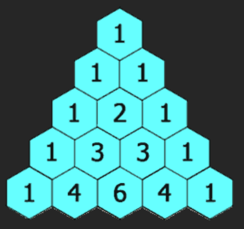

## understanding

Input:一个整数表示杨辉三角的层数,或者返回的列表的元素个数<br>
Operation:得到所有杨辉三角数组<br>
Output:一个列表，列表元素的每行的元素的列表

每行，除了首尾元素是1，其余aij=a[i-1][j-1]+a[i-1][j]，只需要改第i行的1到i-1的元素

## demo

一行一行的找，然后拼接成大列表

```
tc:O()
sc:O()
```

## picture

