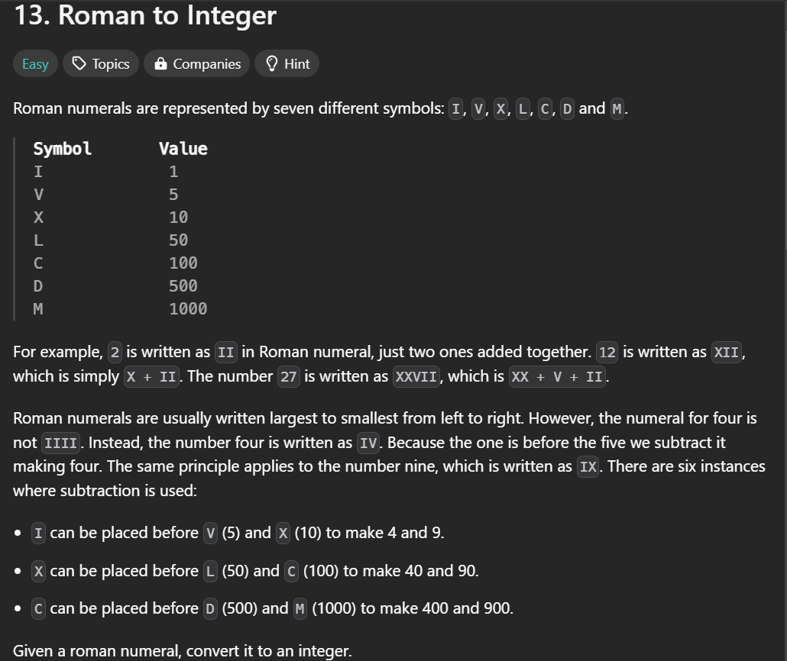
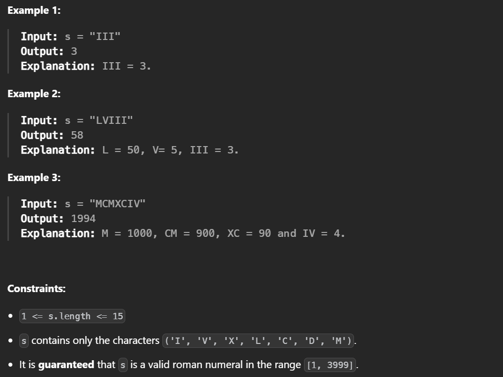

## description:




## understanding

Input:字符串<br>
Operation将字符转换成数字:<br>
Output:整数

Roman number:<br>
I---V---X, 1---5---10<br>
X---L---C, 10---50---100<br>
C---D---M, 100---500---1000

## demo

准备字典，将罗马数字和阿拉伯数字对应
根据规则，左面小于右面就减去左面

```
tc:O(n)
sc:O(1)
```
