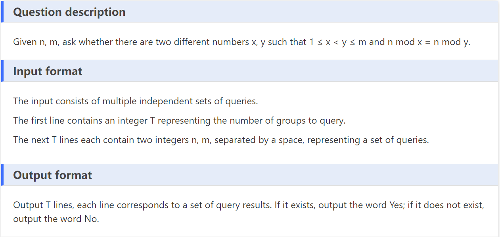
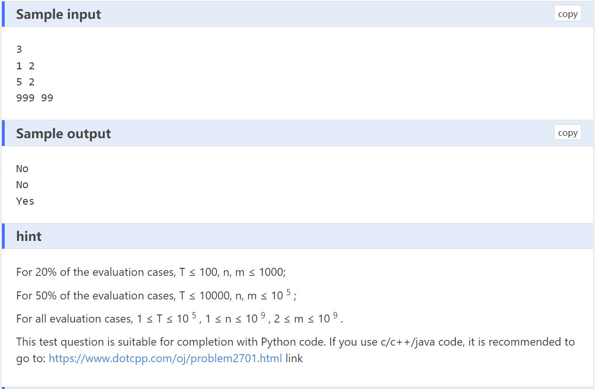

#### [url](https://www.dotcpp.com/oj/problem2735.html)

## hints

```
let mod = n % k, then mod belongs to [0, k-1]
```

```
let mod = n % k and k ranges from [1, t], 
if mod != k-1, then among [1, k] 
at least two integers have the same remainder
```