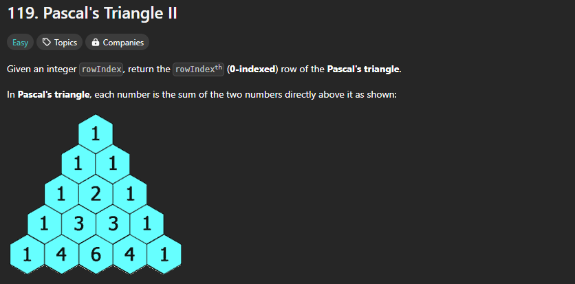
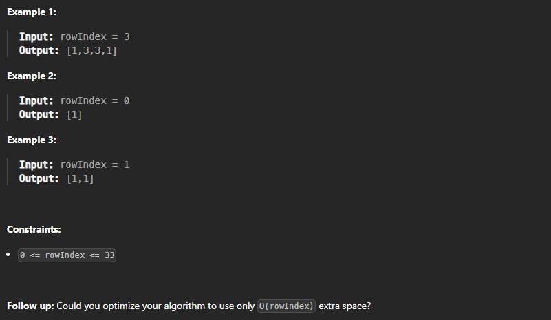

## description:




## understanding

Input:一个整数表示杨辉三角的层数<br>
Operation:得到所有杨辉三角数组<br>
Output:返回该层所有元素

每行，除了首尾元素是1，其余aij=a[i-1][j-1]+a[i-1][j]，只需要改第i行的1到i-1的元素

## demo

一行一行的找

```
tc:O(n²)
sc:O(n²)
```

## demo2(recommended)

一行一行的找,只需要最后一行所需的空间

```
tc:O(n²)
sc:O(n)
```