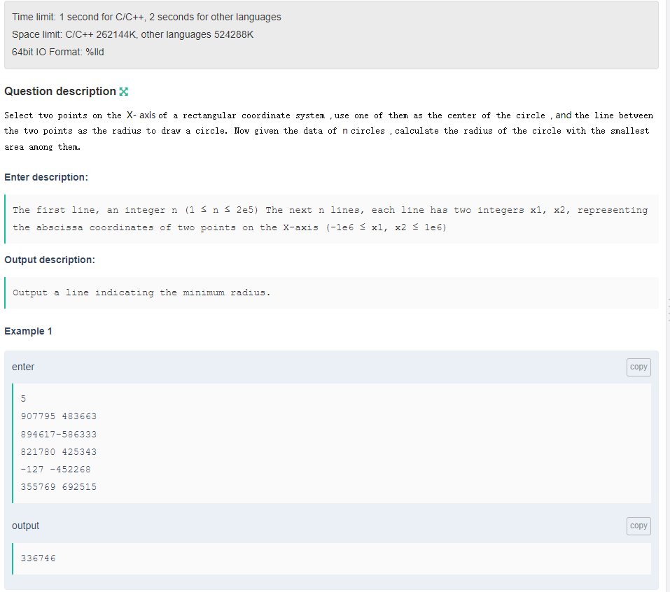
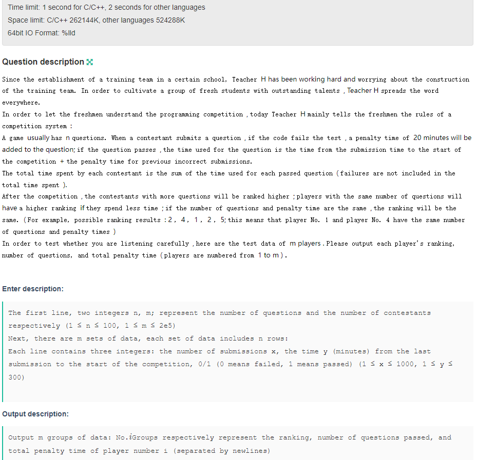

## A



## B



Enter

```
5 5
406 242 0
755 260 1
431 234 0
9 123 0
722 249 0
548 2 0
235 260 0
463 183 1
354 156 0
583 122 0
815 64 1
963 116 1
644 57 0
437 54 0
994 195 1
448 85 0
668 45 1
180 206 0
329 276 1
781 86 0
991 184 1
466 223 0
139 295 0
45 267 0
766 27 0
```

Output

```
4
1
15340
3
1
9423
1
3
55755
2
2
20221
5
1
19984
```